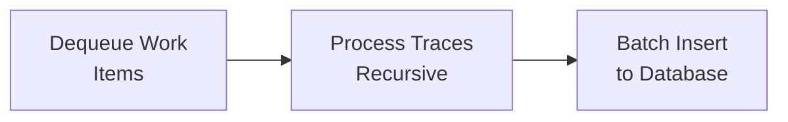

# Internal Transaction Extension - Enhanced Documentation

## Overview

The Internal Transaction Extension is a high-performance, producer-consumer architecture designed to collect and index EVM internal transactions using the `debug_traceBlockByNumber` RPC method. This extension processes transaction traces to capture all internal calls (such as contract-to-contract interactions) that occur during transaction execution.

## Architecture Overview

### Core Components

1. **InternalTxExtension**: Main orchestrator managing the entire pipeline
2. **WorkQueue**: Thread-safe, bounded queue for decoupling production and consumption
3. **Producer**: Scrapes blockchain data and queues work items
4. **Consumer**: Processes work items and persists to database
5. **Address Extraction**: Intelligent address parsing from transaction inputs

### Key Features

- **Concurrent Producer-Consumer Pattern**: Decoupled data fetching and processing
- **Batch Processing**: Optimized batch scraping and database operations
- **Intelligent Queue Management**: Bounded queue with backpressure handling
- **Context-Aware Cancellation**: Graceful shutdown support
- **Address Intelligence**: Extracts addresses from transaction inputs and parameters
- **Error Recovery**: Handles node version compatibility and RPC failures
- **Database Optimization**: Batch inserts with conflict resolution

## Detailed Architecture

### 1. Producer Pipeline


**Process Flow:**

1. **Height Discovery**: Queries `CollectedBlock` table for processable heights
2. **Batch Size Adjustment**: Dynamically adjusts batch size based on:
   - Queue capacity
   - Available blocks
   - Configuration limits
3. **Concurrent Scraping**: Uses `errgroup` for parallel RPC calls
4. **Work Item Creation**: Packages scraped data into work items

### 2. Consumer Pipeline



**Process Flow:**

1. **Work Item Retrieval**: Blocks until work items are available
2. **Transaction Processing**: Recursively processes nested call traces
3. **Address Extraction**: Parses addresses from transaction data
4. **Database Persistence**: Batch inserts with conflict handling

### 3. Data Structures

#### Transaction Hierarchy

```json
{
  "result": [
    {
      "txHash": "0x...",
      "result": {
        "type": "CALL",
        "from": "0x...",
        "to": "0x...",
        "value": "0x0",
        "calls": [
          {
            "type": "CALL",
            "from": "0x...",
            "to": "0x...",
            "calls": [...]  // Nested calls
          }
        ]
      }
    }
  ]
}
```

#### Internal Processing Structure

- **Index**: Sequential numbering of calls within a transaction
- **ParentIndex**: Reference to parent call (-1 for top-level)
- **Sequence**: Global sequence number for database ordering
- **Account Relations**: Bidirectional edges for address lookups

### 4. Address Extraction Algorithm

The extension intelligently extracts addresses from multiple sources:

1. **Direct Addresses**: `from` and `to` fields
2. **Input Parsing**: Extracts addresses from function parameters
   - Removes function selector (first 4 bytes)
   - Scans 32-byte chunks for address patterns
   - Identifies addresses with `0x000000000000000000000000` prefix
3. **Address Normalization**: Converts to Cosmos address format

**Example Input Processing:**

```
Input: 0x12345678000000000000000000000000111111111111111111111111111111111111111100000000000000000000000022222222222222222222222222222222222222220000000000000000000000003333333333333333333333333333333333333333

Function Selector: 0x12345678 (removed)
Parameter 1: 0x000000000000000000000000111111111111111111111111111111111111111 (address)
Parameter 2: 0x000000000000000000000000222222222222222222222222222222222222222 (address)
Parameter 3: 0x000000000000000000000000333333333333333333333333333333333333333 (address)
```

### 5. Queue Management

#### WorkQueue Features

- **Bounded Capacity**: Prevents memory exhaustion
- **Blocking Operations**: Provides backpressure
- **Context Support**: Respects cancellation
- **Thread Safety**: Concurrent producer/consumer access

#### Queue Operations

```go
// Producer side
for !queue.IsNotFull() {
    time.Sleep(100 * time.Millisecond)
```
